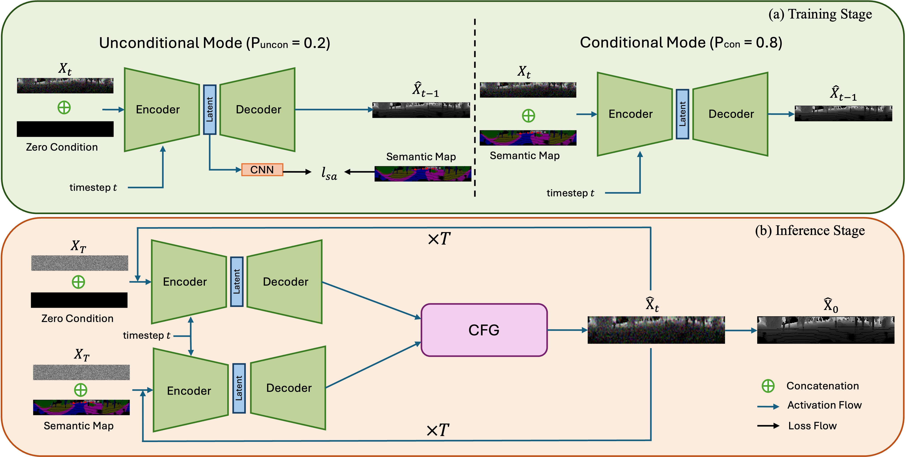
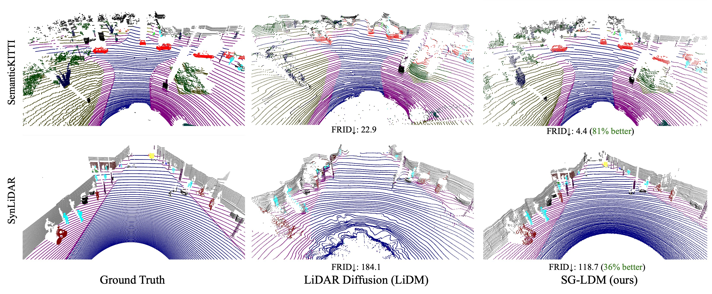

## 📘 Introduction  
This repository provides the official implementation of our **ICCV 2025** paper:  
**“SG-LDM: Semantic-Guided LiDAR Generation via Latent-Aligned Diffusion.”**  

<p align="center">
  
</p>

---

## 🛠️ Environment Setup  

The code has been tested with:  
- **CUDA:** 11.8.0
- **Python:** 3.8.20
- **PyTorch:** 1.13.1  

Other dependency versions and environment details can be found in the `requirements.txt` file.

## 💾 Checkpoint Setup  

Download and unzip the pretrained model checkpoint from [weights](https://drive.google.com/file/d/1AkfEpo1tFEz-7xnZlwaqFkpwEHnZBs2x/view?usp=drive_link), and place it in the root directory before running inference.

## 🚀 Generation  

After setting up the environment, you can run inference with a single command:  

```bash
accelerate launch inference/inference_parallel.py --guidance_scale 2
```

## 📂 Generated Samples  

We provide generated samples for the **SemanticKITTI Sequence 08** benchmark. The generated LiDAR range images and corresponding semantic maps can be downloaded from [samples](https://drive.google.com/file/d/1kIzONRNsMyr0GnE9B_tenBLYEHx60ZbO/view?usp=drive_link).  

Each sample follows the same directory and naming convention as the SemanticKITTI dataset for easy comparison and evaluation.

## 🖼️ Qualitative Comparison


## 🤝 Acknowledgement
Our implementation builds upon previous open-source works on diffusion-based LiDAR generation and range image modeling, including:  
- [LiDAR Diffusion](https://github.com/hancyran/LiDAR-Diffusion)  
- [RangeLDM](https://github.com/WoodwindHu/RangeLDM)

We sincerely thank the authors of these projects for their valuable contributions to the research community.  

If you find our work useful in your research, please consider citing:  

```bibtex
@inproceedings{xiang2025sgldm,
  title={{SG-LDM}: Semantic-Guided LiDAR Generation via Latent-Aligned Diffusion},
  author={Xiang, Zhengkang and Li, Zizhao and Khodabandeh, Amir and Khoshelham, Kourosh},
  booktitle={ICCV},
  year={2025}
}
